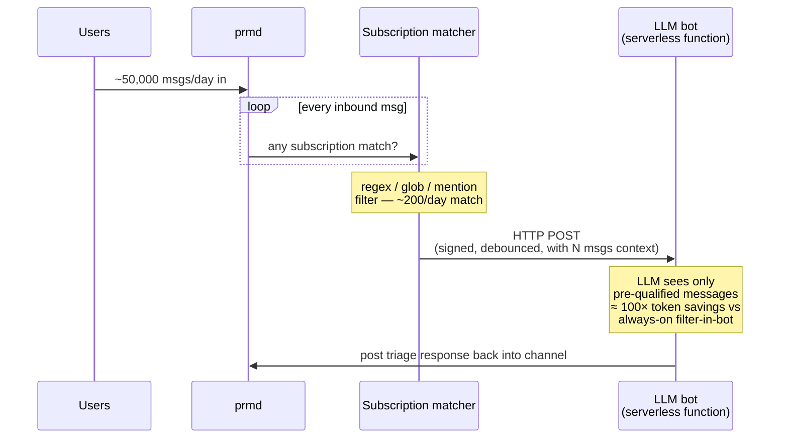
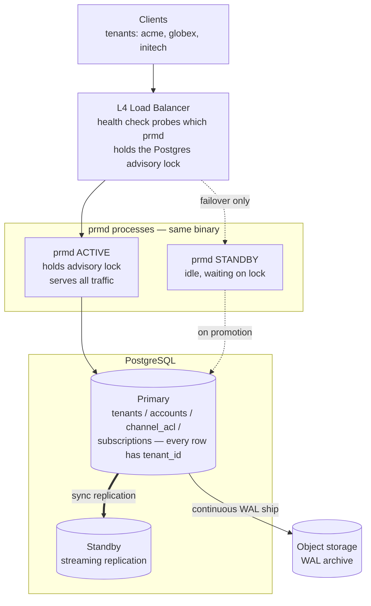
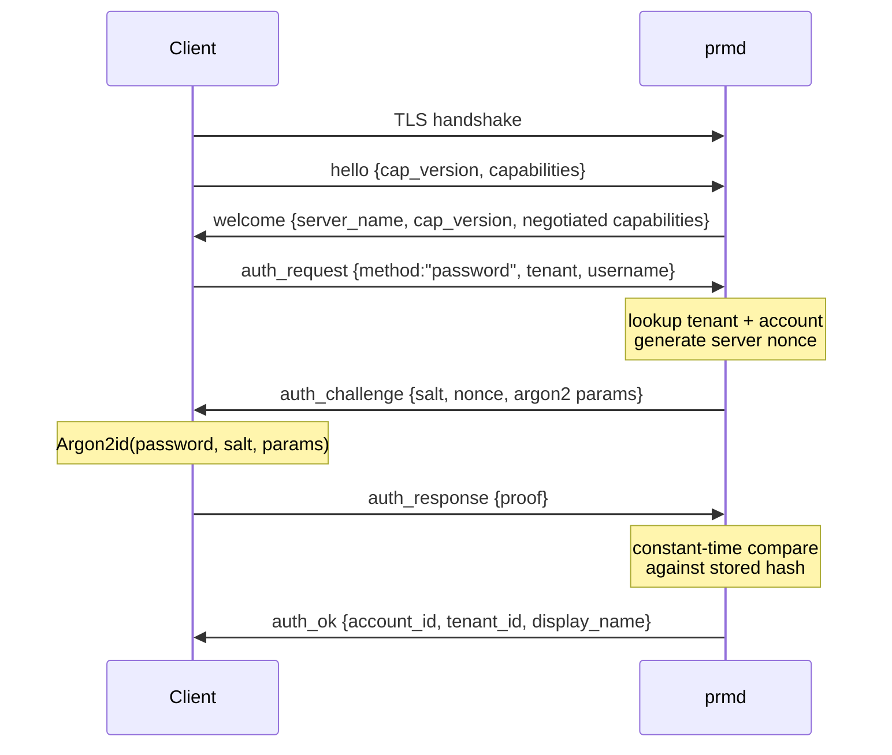
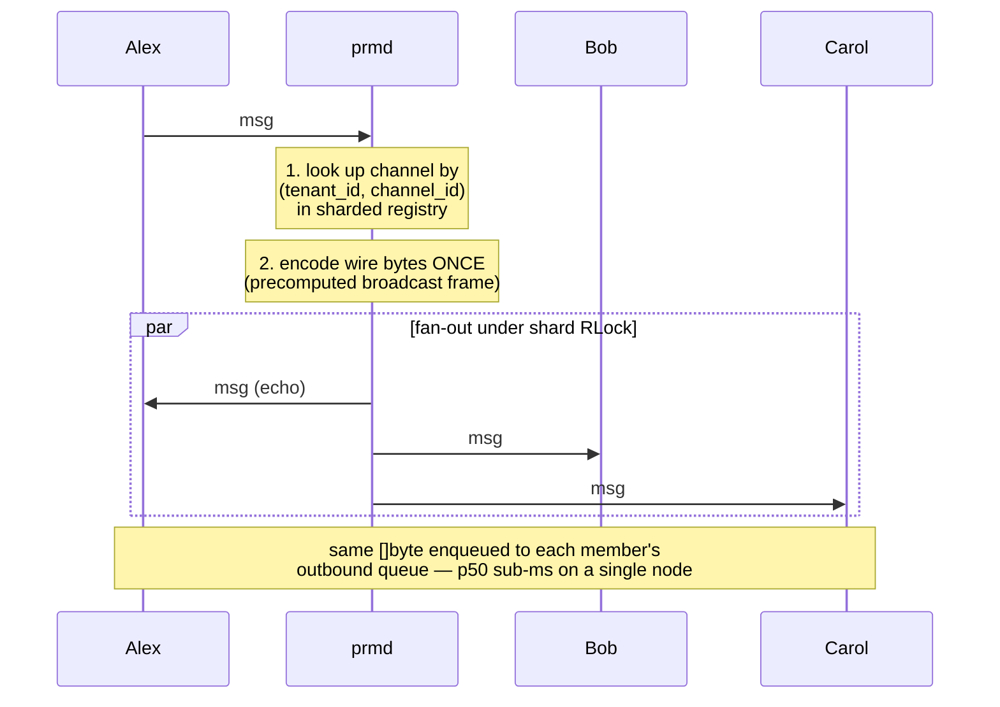

# PRM — Private Relay Messaging

A high-speed, auth-required chat relay built for LLM-powered bots as first-class citizens. Similar shape to IRC — server, channels, identities, private messages — but a fresh wire protocol and modern primitives throughout.

**Status:** slices 1, 2, and 3 implemented. Real TLS server, password + token auth, multi-tenant from day one, explicit channels with ACL enforcement, bot accounts with API tokens, TUI client with reconnect, hot-standby HA pattern with operator runbook, and **the headline value-prop layer: webhook subscriptions with server-side filter pushdown, debounce + cooldown + budget caps, HMAC-signed POSTs, and context-attach**. End-to-end test stands up the full stack (realtime + REST + webhook manager + fake bot) and verifies a chat message triggers a signed webhook with preceding messages attached. Sub-ms p50 fan-out preserved. See [DESIGN.md](DESIGN.md#implementation-slices) for the full slice plan.

## Try it locally

```bash
git clone https://github.com/biffsocko/prm && cd prm
go build ./...

# initialize storage + a tenant + accounts
./prmd admin create-tenant --storage sqlite:./prm.db --display-name "Acme Corp" acme
./prmd admin create-account --storage sqlite:./prm.db --password hunter2 acme alex
./prmd admin create-account --storage sqlite:./prm.db --password x --bot acme alertbot

# create channels (slice 2: channels are explicit, ACL-enforced)
./prmd admin create-channel --storage sqlite:./prm.db --public acme general alex
./prmd admin create-channel --storage sqlite:./prm.db acme private-room alex
./prmd admin grant --storage sqlite:./prm.db acme private-room alertbot member

# issue a bot API token (printed once)
TOKEN=$(./prmd admin issue-token --storage sqlite:./prm.db --label primary acme alertbot | awk '/TOKEN:/{print $2}')

# start the server (dev mode = self-signed cert for localhost)
./prmd admin generate-cert --out-dir ./certs localhost
./prmd serve --dev --storage sqlite:./prm.db &

# connect as a human (password)
PRM_PASSWORD=hunter2 ./prm --insecure localhost:6697 acme alex general

# connect as a bot (token)
./prm --insecure --token "$TOKEN" localhost:6697 acme alertbot private-room

# create a webhook subscription (REST control plane on :8443)
curl -k -X POST https://localhost:8443/v1/subscriptions \
  -H "Authorization: Bearer $TOKEN" \
  -H "Content-Type: application/json" \
  -d '{
    "channel_name": "general",
    "url": "https://my-bot.example.com/prm-webhook",
    "match": {"any_of":[{"type":"regex","pattern":"(?i)^deploy"}]},
    "context_lines": 8,
    "debounce_ms": 500,
    "cooldown_ms": 5000,
    "budget": {"daily_max_fires": 500}
  }'
# The 201 response includes a one-time "secret" -- use it to verify the
# HMAC on incoming webhook POSTs in your bot's handler.
```

## Benchmark numbers (slice 1, single laptop, Apple Silicon)

| Members | p50 | p95 | p99 | max |
|--------:|----:|----:|----:|----:|
| 10 | 241 µs | 527 µs | 761 µs | 827 µs |
| 50 | 291 µs | 440 µs | 734 µs | 875 µs |
| 100 | 570 µs | 843 µs | 1.89 ms | 2.45 ms |

Sub-ms p50 fan-out holds at every tested size. Reproduce with `go test -run TestFanoutLatency -v ./test/bench/`.


## Why PRM exists

Running an LLM-powered bot on top of a traditional chat protocol (IRC, Matrix, even Discord/Slack via gateways) has a quiet but expensive problem: **the bot has to look at every message to decide whether to respond.** Even when a regex would have ruled most messages out, the bot is typically built to call the model for "should I respond? what should I say?" — and that call costs tokens whether the model decides to respond or not.

PRM moves the filter to the server. Bots register **subscriptions** that say "POST me when channel `#ops` gets a message matching `/^deploy/i`" or "when `@alertbot` is mentioned anywhere." The server runs the filter, fires a webhook only on matches, and includes a configurable window of preceding channel context in the payload. The bot's LLM only ever sees pre-qualified messages — and it gets them with context already attached, in one HTTP POST, with no persistent connection to maintain.

This compounds well:

- **No persistent connection** — bots can be serverless functions (Lambda, Cloudflare Workers, Cloud Run) that wake only when a trigger fires. No idle cost, no reconnect logic, no scrollback to manage.
- **Pre-attached context** — when a webhook fires, the payload includes the matching message *plus* N preceding messages of channel context. The bot doesn't fetch separately or maintain its own ring buffer. One webhook = one LLM call with everything needed.
- **Debounce window** — multiple matches inside a short window collapse into a single fire. A 10-message burst of `@bot` mentions becomes one LLM call, not ten.
- **Server-side cooldown** — per-subscription rate limits prevent thrashing on tight back-and-forths.
- **Budget caps** — a subscription can declare "I cost roughly $0.02 per fire" and the server enforces an hourly/daily ceiling. Hobby bots on metered LLM accounts stop getting fired past the budget, instead of burning through it during a busy day.

For a bot that previously processed 50,000 channel messages a day and only needed to respond to ~200 of them, the LLM-token reduction is roughly **two orders of magnitude** — you stop paying the model to decide "no" 49,800 times.




## Built for production deployments

PRM is multi-tenant from day one and has a real disaster-recovery story. The operational shape isn't an afterthought — it's part of the design.

- **Multi-tenant.** A single PRM deployment hosts many organizations / workspaces, each fully isolated. Tenants cannot see each other's data under any circumstance; the implementation rule is that no domain query is written without `tenant_id` as a leading predicate. Per-tenant quotas, rate limits, and usage accounting.
- **PostgreSQL as the primary storage.** SQLite is available for small / homelab deployments, but production targets Postgres 15+ — for replication, migrations across many tenants, and operational maturity. Storage is configurable: `--storage postgres://...` or `--storage sqlite:./prm.db`, same binary, same code.
- **Hot-standby high availability** (slice 2 onward). Two PRM processes pointed at a Postgres primary + streaming-replication standby. Leader election via Postgres advisory lock; L4 load balancer flips on health-check failure. **RPO zero** for committed Postgres writes; **RTO under 60 seconds**.
- **Continuous backup.** Postgres WAL archived to object storage (S3 / MinIO / equivalent) on a seconds-scale interval. RPO measured in seconds; restore runbook with a tested restore-verification script.
- **Performance preserved under all of this.** Sub-millisecond p50 fan-out is the goal because the hot path never touches durable storage. Multi-tenancy adds one hash dimension to the channel state key; HA adds zero steady-state overhead (standby is idle until needed). The performance impact table is in [DESIGN.md](DESIGN.md#performance-impact-of-ha).

The operational honesty: the PRM binary is single-file, but the production deployment is `PRM + Postgres + LB` — that triple, not "PRM alone." Said up front so nobody is surprised.



Tenant isolation is enforced at the type system: every storage function takes `tenantID` as its leading argument, so a query that forgets to scope by tenant won't compile. On failover the standby PRM takes the Postgres advisory lock, the load balancer flips, and clients reconnect — in-memory channel state rebuilds from the durable ACL data plus reconnecting members. RPO is zero (synchronous replication); RTO is under 60s.

## How it works

### System overview

```mermaid
flowchart LR
    subgraph clients[Clients]
        H[Human clients<br/>TUI / web]
        BC[Bots<br/>persistent conn]
        BW[Bots<br/>webhook only]
    end
    subgraph server[prmd — single binary]
        TLS[TLS listener :6697<br/>JSON-line framing]
        REST[REST control plane :8443<br/>tenants / channels / subs]
        Reg[Channel registry<br/>in-memory, sharded]
        WH[Webhook worker pool<br/>signed HMAC POSTs]
        IN[Inbound integration handler<br/>/v1/inbound/&#123;id&#125;]
        ST[Storage interface]
    end
    PG[(PostgreSQL<br/>primary)]
    SQ[(SQLite<br/>alt for small deploys)]
    subgraph external[External event sources]
        Splunk
        Graylog
        GH[GitHub<br/>etc.]
    end

    H -->|TLS| TLS
    BC -->|TLS| TLS
    TLS <--> Reg
    Reg --> WH
    WH -->|POST| BW
    REST --> ST
    Reg -.->|JOIN: ACL lookup| ST
    ST --> PG
    ST -. or .-> SQ
    Splunk -->|webhook| IN
    Graylog -->|webhook| IN
    GH -->|webhook| IN
    IN --> Reg
```



The PRM binary is one process with two TLS listeners: realtime (where chat clients and persistent bots connect) and REST (control plane for account / channel / subscription / integration management). Channel state is in-memory and sharded; the message-fan-out path never touches storage. External event sources POST into the inbound handler, which republishes events as channel messages — picked up by the same bot subscription machinery as native chat.

### Connect + authenticate



Three frames after the TLS handshake. The challenge carries the account's stored Argon2id parameters so tuning the cost factor doesn't invalidate existing hashes. The connection is bound to one tenant for its lifetime — to switch tenants, reconnect.

### Channel message fan-out (the hot path)



The hot path is in-memory only. ACLs are checked at JOIN time and cached in the channel's member list; broadcasting never touches Postgres. The wire bytes are computed once per inbound message and the same `[]byte` is pushed onto every member's per-connection outbound queue, so fan-out scales linearly without lock contention across channels (the registry is sharded into 64 shards by `hash(tenant_id, channel_id)`).

## Plugging in your existing tools

PRM is not a log platform, alert engine, or event store — it's the *bot orchestration layer* that sits on top of them. To make events from Splunk, Graylog, Datadog, GitHub, CloudWatch, or anything else that can POST JSON show up as PRM events for bots to act on, point those systems at a small inbound webhook:

```
POST /v1/inbound/{integration_id}
Authorization: Bearer <integration-token>
```

Per-source adapters (Splunk and Graylog ship as reference; a generic JSON-path adapter handles the long tail) normalize the payload, republish it as a PRM channel event, and the existing webhook subscription machinery — including the cost savings story above — drives whatever bots care to react. One mental model for chat messages, log alerts, GitHub PRs, deploy notifications.

See [DESIGN.md](DESIGN.md#inbound-integrations) for the adapter contract and the Splunk / Graylog field mappings.

```mermaid
sequenceDiagram
    participant Splunk
    participant IN as prmd<br/>/v1/inbound/&#123;id&#125;
    participant Reg as Channel registry
    participant Sub as Subscription matcher
    participant Bot as LLM triage bot

    Splunk->>IN: POST {search_name, result} <br/>Authorization: Bearer ...
    Note over IN: per-source adapter normalizes:<br/>event{source, service, severity,<br/>summary, fields, occurred_at}
    IN->>Reg: republish as channel event
    Reg->>Sub: subscription match?
    Note over Sub: filter pre-qualifies<br/>(e.g., severity ≥ error)
    Sub->>Bot: signed POST<br/>(with N msgs of channel context)
    Bot->>Reg: post triage summary back to channel
```




## How does PRM compare to Redis or RabbitMQ?

Different problems, but the question comes up because both are commonly used as pub/sub layers for chat-adjacent systems. Quick guide:

- **Redis pub/sub** is brutally fast at raw publish-to-N-subscribers fan-out — tight C, sub-100μs p50 on a LAN. For pure pub/sub throughput on a single node, Redis probably wins. PRM with careful Go tuning can match it but pays JSON framing and Go GC overhead Redis doesn't.
- **RabbitMQ** optimizes for correctness (acks, persistence, dead-letter routing, exchanges) rather than latency. Typical p50 is 1–10ms, higher with persistence. PRM beats it on latency easily by skipping the features PRM doesn't need.
- **For chat-shaped workloads** (channels, ACLs, presence, identities) PRM is purpose-built. Redis and RabbitMQ are generic message buses; you'd build chat semantics on top of either.
- **For LLM-powered bots** PRM wins by a lot, regardless of broker choice. Server-side filter pushdown means an LLM-backed bot pays tokens for *responses*, not *message volume*. Redis and RabbitMQ have no equivalent — if you built bot subscriptions, debounce, cooldown, budget caps, and context-attach on top of either, you'd be reimplementing PRM's bot layer.

If you just need a generic message bus for service-to-service traffic, use Redis or RabbitMQ. If you need chat with bots as first-class users and don't want to reinvent the bot integration layer, that's what PRM is for.

See [DESIGN.md](DESIGN.md#comparison-to-redis-and-rabbitmq) for the dimension-by-dimension breakdown.

## What PRM is *not*

- **Not IRC-compatible.** Existing IRC clients (irssi, weechat, hexchat) will not connect. PRM uses a different wire protocol; you need a PRM client.
- **Not federated.** Single deployment topology. No server-to-server linking between PRM instances or to other chat networks. Hot-standby HA within a single deployment is supported; multi-region geo-replication is not.
- **Not anonymous.** Every connection authenticates. No anonymous join under any setting; the `public` channel visibility just means "any authenticated account may join."
- **Not a message archive (yet).** v0 does not persist chat history. Messages exist in memory for the lifetime of an active channel. Chat history persistence and the `chathistory`-equivalent retrieval API are deferred to v1.

## Project shape (when implementation lands)

Two binaries in one Go module:

- `prmd` — the server
- `prm` — a TUI reference client

Single-binary deploys. SQLite for accounts, channels, ACLs, and webhook subscriptions. TLS-only on the wire. WebSocket Upgrade supported on the same port so browser clients can connect without a separate gateway.

## License

TBD when first code lands.
