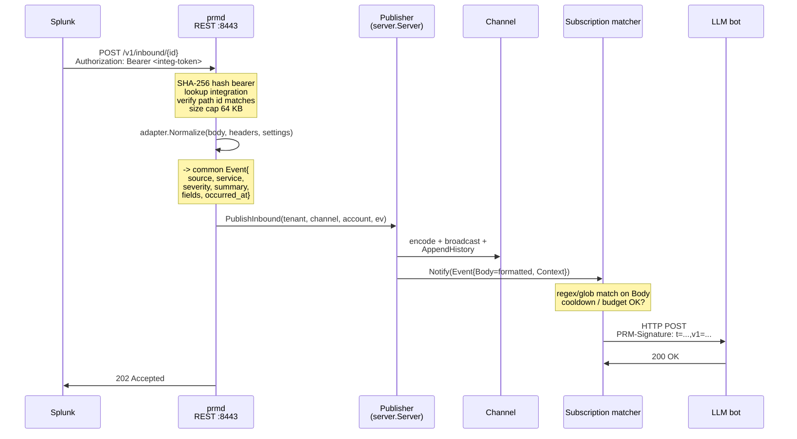

# PRM Inbound Integrations — Operator + Integrator Guide

This document covers how to wire external systems (Splunk, Graylog, GitHub, generic JSON sources) into PRM so their events land on a chat channel and can drive your LLM bots. For the design rationale, see [DESIGN.md](../DESIGN.md#inbound-integrations). For the outbound webhook side (what bots consume), see [WEBHOOKS.md](WEBHOOKS.md).

## TL;DR

PRM isn't a log platform. But your alerting tools already produce structured events — and bots are the highest-value consumers of those events. Inbound integrations let an external system POST a single HTTP request to PRM; PRM normalizes the payload, drops it onto a channel as a chat message, and any matching webhook subscriptions fire with the structured fields attached.

You get:

- **One unified bot inbox.** Splunk alerts, Graylog events, GitHub deploy notifications, k8s pod events — all flow through the same channel-and-subscription machinery your chat-driven bots already use.
- **Pre-qualified events.** Subscriptions filter on a regex against the formatted Body (`[severity] source/service: summary`), so a Claude-powered triage bot only burns tokens on events that pre-qualified.
- **No new bot protocol.** A bot that already handles outbound webhooks for chat messages handles inbound-integration-driven events with zero code changes.

---

## End-to-end flow



The inbound POST is 202 because delivery to bots is asynchronous on a worker pool — even if Splunk's alert fires a thundering herd, the chat broadcast path is bounded and webhook fan-out is on the existing worker pool with retry + debounce + cooldown + budget caps from slice 3.

---

## Body format on the bound channel

When an inbound event lands, PRM republishes it as a chat message with the body formatted like:

```
[<severity>] <source>[/<service>]: <summary>
```

Examples:

```
[error] splunk/auth-api: Auth API 5xx Spike (count=47)
[critical] graylog/db-primary: DB out of disk
[info] generic: Build #42 succeeded
[warn] splunk: Anomaly detected
```

This is regex-friendly. A subscription that fires on critical-or-error events from any inbound source:

```json
{"any_of":[{"type":"regex","pattern":"^\\[(error|critical)\\]"}]}
```

Filter to Splunk's auth-api specifically:

```json
{"any_of":[{"type":"regex","pattern":"^\\[(error|critical)\\] splunk/auth-api:"}]}
```

The full structured payload (the adapter's `Event.Fields` map) is preserved on the channel's history ring for context-attach, but it's not yet directly accessible to subscriptions for matching — slice 5+ adds field-level rules. For now, encode whatever you need to filter on into the summary or set up a generic adapter that produces a body summary that distinguishes what you care about.

---

## Creating an integration

```bash
./prmd admin create-integration \
  --storage sqlite:./prm.db \
  acme ops alertbot splunk
```

`<tenant-slug>`, `<channel-name>`, `<owner-username>` (an existing bot or human account in the tenant; the account that "speaks" the republished events), and `<adapter>` (`splunk` | `graylog` | `generic`).

For adapters that need per-integration configuration, pass `--settings` as a JSON string:

```bash
./prmd admin create-integration \
  --storage sqlite:./prm.db \
  --settings '{"service_field":"service_name"}' \
  acme ops alertbot splunk
```

The output:

```
Created integration (token shown ONCE -- save it now)
  ID:       019e3bbf-b303-72af-9fee-dd0eb745dc78
  Tenant:   acme (019e3bbf-...)
  Channel:  #ops (019e3bbf-...)
  Adapter:  splunk
  POST URL: /v1/inbound/019e3bbf-b303-72af-9fee-dd0eb745dc78
  TOKEN:    Puk4Jj9hQQWOEh7JRGsDvwwCX_GksS7A38o6T7204h0
```

The full inbound URL is `https://<your-prmd-host>:8443/v1/inbound/<integration-id>`. Drop this into the upstream's webhook configuration; pass the TOKEN as `Authorization: Bearer <token>`.

`prmd admin list-integrations <tenant-slug>` shows active and disabled integrations. `prmd admin revoke-integration <tenant-slug> <integration-id>` disables one (its token immediately stops being accepted).

---

## Splunk

Splunk's **Webhook** alert action POSTs JSON of this shape:

```json
{
  "sid":          "scheduler__admin__...",
  "search_name":  "Auth API 5xx Spike",
  "app":          "search",
  "owner":        "admin",
  "results_link": "https://splunk.example.com/...",
  "result":       { "status_code": "503", "service": "auth-api", "count": "47" }
}
```

The Splunk adapter maps:

| Event field | From |
|---|---|
| `Source` | `"splunk"` |
| `Service` | `result.<service_field>` (default `service`; override via `--settings '{"service_field":"foo"}'`) |
| `Severity` | `result.<severity_field>` if set, otherwise derived from `search_name` text — `critical`/`outage`/`down`/`fatal` → `critical`; `error`/`5xx`/`failure` → `error`; `warn`/`anomaly`/`spike` → `warn`; otherwise `info` |
| `Summary` | `search_name`, suffixed with ` (count=N)` if `result.count` is present |
| `Fields` | the entire `result` object + `sid`, `app`, `owner`, `results_link` |
| `OccurredAt` | server-side `now()` — Splunk's payload doesn't carry a reliable trigger timestamp |

Setup in Splunk:

1. Edit your alert. Trigger Actions → Add Action → Webhook.
2. **URL:** `https://your-prmd-host:8443/v1/inbound/<integration-id>`.
3. Splunk doesn't have a direct "set Authorization header" UI; the workaround is to put the token in the URL via a custom alert action wrapper OR use a transformation-layer proxy. (PRM doesn't ship that proxy; future improvement.)
4. Save.

Settings options:

```json
{
  "service_field":  "service",          // result key holding the service identifier
  "severity_field": "severity",         // optional; result key holding severity label
  "summary_fmt":    ""                  // reserved; not yet honored
}
```

---

## Graylog

Graylog's **HTTP Notification** (Event Definitions) POSTs:

```json
{
  "event_definition_id":    "...",
  "event_definition_type":  "aggregation-v1",
  "event_definition_title": "Auth API error rate",
  "event": {
    "timestamp": "2026-05-18T03:00:00.000Z",
    "message":   "Auth API error rate > 5/min",
    "fields":    { "service": "auth-api", "level": "ERROR" },
    "priority":  3
  }
}
```

The Graylog adapter maps:

| Event field | From |
|---|---|
| `Source` | `"graylog"` |
| `Service` | `event.fields.<service_field>` (default `service`) |
| `Severity` | `event.fields.level` if present, else derived from `event.priority` (1=`info`, 2=`warn`, 3=`error`) |
| `Summary` | `event.message`, fallback to `event_definition_title` |
| `Fields` | `event.fields` + `event_definition_id`/`type`/`title` + `priority` |
| `OccurredAt` | `event.timestamp` if present, else `now()` |

Setup in Graylog:

1. Notifications → Create Notification → HTTP Notification.
2. **URL:** the integration's POST URL.
3. **Authorization Header:** Graylog supports custom headers — add `Authorization: Bearer <token>`.
4. Attach to one or more Event Definitions.

Settings options:

```json
{ "service_field": "service" }
```

---

## Generic adapter (anything that POSTs JSON)

For GitHub webhooks, CloudWatch alarms (via SNS), Jenkins post-build hooks, Kubernetes Events forwarders, ad-hoc cron jobs, etc. Configured via a tiny JSON-path subset in `--settings`:

```bash
./prmd admin create-integration \
  --storage sqlite:./prm.db \
  --settings '{
    "summary_path":     "$.alert.summary",
    "service_path":     "$.alert.service",
    "severity_path":    "$.alert.severity",
    "occurred_at_path": "$.alert.timestamp",
    "severity_map":     {"P1":"critical","P2":"error","P3":"warn"},
    "include_raw":      true
  }' \
  acme ops alertbot generic
```

Path syntax: `$.foo.bar.baz` for objects, `$.items.0.name` for arrays. No wildcards, no predicates — keep it boring; if you need more, write a real adapter.

`severity_map` is an optional explicit remap that runs BEFORE the standard severity normalization (so you can translate vendor codes like `P1` into `critical`).

`include_raw: true` keeps the entire original request body on the `Event.Raw` field for debugging / replay (not yet exposed via API, but stashed for the audit endpoint that lands in slice 4+).

If the upstream POSTs an array root, the adapter wraps it as `{"body": [...]}` so paths like `$.body.0.foo` work.

---

## Writing a new adapter

If you're integrating something specific (PagerDuty, Datadog, Sentry, an internal system), and the generic adapter's JSON-path config isn't a clean fit, write a typed adapter.

```go
package adapters

import (
	"encoding/json"
	"fmt"
	"net/http"
	"time"

	"github.com/biffsocko/prm/internal/inbound"
)

type Pagerduty struct{}

func (Pagerduty) Name() string { return "pagerduty" }

func (Pagerduty) Normalize(body []byte, _ http.Header, _ []byte) (inbound.Event, error) {
	var p struct {
		Event struct {
			Action string `json:"event_action"`
			Payload struct {
				Summary  string         `json:"summary"`
				Source   string         `json:"source"`
				Severity string         `json:"severity"`
				CustomDetails map[string]any `json:"custom_details"`
			} `json:"payload"`
		} `json:"event"`
	}
	if err := json.Unmarshal(body, &p); err != nil {
		return inbound.Event{}, fmt.Errorf("%w: %v", inbound.ErrAdapterBadInput, err)
	}
	if p.Event.Payload.Summary == "" {
		return inbound.Event{}, fmt.Errorf("%w: payload.summary", inbound.ErrAdapterMissing)
	}
	return inbound.Event{
		Source:     "pagerduty",
		Service:    p.Event.Payload.Source,
		Severity:   inbound.NormalizeSeverity(p.Event.Payload.Severity),
		Summary:    inbound.Truncate(p.Event.Payload.Summary, 200),
		Fields:     p.Event.Payload.CustomDetails,
		OccurredAt: time.Now().UTC(),
		Raw:        json.RawMessage(body),
	}, nil
}

func init() { inbound.Register(Pagerduty{}) }
```

That's the entire adapter. Drop it under `internal/inbound/adapters/pagerduty.go`, the blank-import in `cmd/prmd/main.go` already pulls in the whole adapters package, so it self-registers on startup. Add adapter-specific Settings JSON if needed (pass through `Normalize`'s third arg).

---

## Security

- **Bearer tokens are scoped to one integration.** The token shown at create is the only credential PRM accepts at `/v1/inbound/{id}`. SHA-256 hash at rest; revocation flips `disabled_at` and storage's hash lookup immediately stops matching.
- **Path id verification.** The handler refuses if the bearer's integration id doesn't match the URL path — protects against "leak one token, use it on a different URL" cross-config attacks. The error code (`invalid_token`) is the same either way so the responder can't probe which integrations exist.
- **Tenant suspension.** A suspended tenant's integrations stop accepting POSTs (403 `tenant_suspended`).
- **Size cap.** Default 64 KB. Excess returns 413 with no body read — your reverse proxy / k8s ingress should also enforce its own cap matching this.
- **No HMAC verification of the inbound request body** in v0 — bearer-token auth is the trust model. If you need cryptographic proof that Splunk specifically sent a payload (vs. someone who has the bearer), put a verifying proxy in front (e.g., Lambda + GitHub-webhook-style HMAC check), then forward to PRM with the bearer.

---

## What's still manual / out of scope

- **Rate limiting per integration.** Not yet implemented; relies on whatever your reverse proxy / cloud LB does.
- **Per-integration audit endpoint** (`/v1/integrations/{id}/events`) — `Event.Raw` is captured in memory only during the request; there's no durable event log yet. Slice 5+.
- **Adapter-side reply.** Inbound is one-way: PRM returns 202 Accepted, your bots react via outbound webhooks. No mechanism for an inbound source to "wait for a bot answer" inline.
- **Bidirectional Slack/Teams bridges.** Out of scope; PRM is its own protocol with bot-friendly primitives, not a translator.
