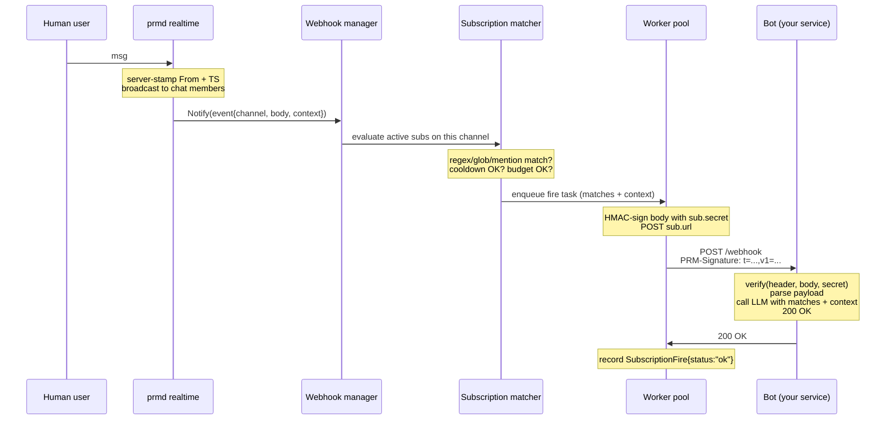

# PRM Webhooks — Bot Author + Operator Guide

This document covers how to create, manage, and receive PRM webhook subscriptions. For the design rationale, see [DESIGN.md](../DESIGN.md#cost-savings-model). For the high-availability story that wraps the webhook delivery path, see [HA.md](HA.md).

## TL;DR

Your bot has an API token (issued via `prmd admin issue-token`). You POST a subscription to PRM's REST control plane describing a channel, a match rule, and your bot's webhook URL. When chat messages match the rule, PRM sends a signed HTTP POST to your URL with the matching message(s) plus preceding channel context. Your bot verifies the HMAC signature and acts on the payload.

The win versus an always-on bot maintaining a persistent connection: your LLM only sees messages that pre-qualified by your match rule, not every line of channel chatter. For a busy channel that 100× difference is real money.

---

## End-to-end flow



The hot path (`U → S → chat members`) is **always** completed before the webhook fan-out starts. Webhook delivery is on a separate worker pool; a slow bot endpoint never slows down chat.

---

## Creating a subscription

The REST control plane listens on TLS port `:8443` by default. Authenticate with your bot's API token via `Authorization: Bearer <token>`.

```bash
curl -k -X POST https://prm.example.com:8443/v1/subscriptions \
  -H "Authorization: Bearer $PRM_BOT_TOKEN" \
  -H "Content-Type: application/json" \
  -d '{
    "channel_name": "ops",
    "url": "https://my-bot.example.com/prm-webhook",
    "match": {
      "any_of": [
        {"type": "regex", "pattern": "(?i)^deploy\\b"},
        {"type": "regex", "pattern": "(?i)\\brollback\\b"}
      ]
    },
    "context_lines": 8,
    "debounce_ms": 500,
    "cooldown_ms": 5000,
    "budget": {"daily_max_fires": 500}
  }'
```

The response is `201 Created` with the subscription record. **The `"secret"` field is plaintext and shown exactly once** — stash it in your bot's config alongside its API token. You need it to verify the HMAC on incoming webhook POSTs.

```json
{
  "id": "019e3551-a7b2-7c83-9e10-...",
  "tenant_id": "...",
  "account_id": "...",
  "channel_id": "...",
  "url": "https://my-bot.example.com/prm-webhook",
  "secret": "Pq8x...rOZk",            // <-- save this; you won't see it again
  "match": { ... },
  "events": ["message"],
  "context_lines": 8,
  "debounce_ms": 500,
  "cooldown_ms": 5000,
  "budget": {"daily_max_fires": 500},
  "created_at": "2026-05-18T03:17:00Z"
}
```

---

## Match rule syntax

A subscription matches when **every** rule in `all_of` matches **and** at least one rule in `any_of` matches (or `any_of` is empty). Empty rules document = match every message.

Three rule kinds:

| Type | Field | Notes |
|---|---|---|
| `regex` | `pattern` | Go `regexp` syntax (RE2). Supports `(?i)` for case-insensitive. |
| `glob` | `pattern` | `path.Match`-style **whole-body** match against trimmed body. |
| `mention` | `account_id` | Matches when the message body references the given account UUID. (Slice 3 has no automatic @-mention parser yet; for now this fires when the resolved mention list contains the account_id — see [DESIGN.md open questions](../DESIGN.md#open-questions).) |

Examples:

```json
// Fire on any deploy or rollback message
{"any_of":[
  {"type":"regex","pattern":"(?i)^deploy\\b"},
  {"type":"regex","pattern":"(?i)\\brollback\\b"}
]}

// Fire only on urgent production deploys
{"all_of":[
  {"type":"regex","pattern":"(?i)urgent"},
  {"type":"regex","pattern":"\\bprod\\b"}
]}

// Fire on a structured command pattern
{"any_of":[{"type":"glob","pattern":"build #*"}]}
```

Bad regex / unknown rule type / missing required fields are rejected with `400 bad_match` at create or update time, not at first fire.

---

## Configuration fields

| Field | Meaning |
|---|---|
| `channel_name` or `channel_id` | Required. Exactly one. Must exist in your tenant. |
| `url` | Required. Where PRM POSTs the webhook. Must accept POST + JSON. |
| `match` | Required. The rules document (above). |
| `events` | Defaults to `["message"]`. Future: `["join", "part", ...]`. |
| `context_lines` | How many preceding channel messages to attach to each fire. Capped by the channel's history depth (32). |
| `debounce_ms` | If multiple matches arrive within this window, **collapse into one fire** with all matches in `payload.matches`. Set to 0 to disable. |
| `cooldown_ms` | Minimum delay between fires. New matches arriving inside the cooldown window are **dropped**. Set to 0 to disable. |
| `budget.daily_max_fires` | Per-day hard cap on successful fires. Failed/dropped fires don't count. Set to 0 for no cap. |
| `budget.estimated_cost_per_fire_usd` | Advisory; recorded but not yet enforced. Useful for accounting. |

### Debounce vs cooldown — when to use which

- **Debounce** is "wait for the burst to settle, then fire once with all of it." Use when you want to react to a *thread of conversation* as a unit. Example: 10 messages in 5 seconds about a deploy → one webhook with all 10 messages → one LLM call.
- **Cooldown** is "don't fire again for N seconds after a successful fire, period." Use to prevent the bot from spamming itself or from racing on rapid back-and-forths. Example: even if 50 matches arrive in the next hour, cap at one fire per 60 seconds.
- Use both together when both apply.

---

## Verifying signatures

Every webhook POST carries a `PRM-Signature` header:

```
PRM-Signature: t=1716000000,v1=8d3...c14
```

The signature is `HMAC-SHA256(secret, "<t>.<body>")` hex-encoded. The leading `t=` lets you reject replays older than your tolerance before doing the HMAC.

Reference Go verifier (the same code PRM uses internally):

```go
import "github.com/biffsocko/prm/internal/webhook"

func verify(headerVal string, body, secret []byte) bool {
    return webhook.Verify(headerVal, body, secret)
}
```

If you don't want a Go dep, the algorithm in 12 lines of anything:

```python
import hashlib, hmac, time

def verify(header: str, body: bytes, secret: bytes, max_age_s: int = 300) -> bool:
    parts = dict(p.split("=", 1) for p in header.split(","))
    t = int(parts.get("t", "0"))
    if abs(time.time() - t) > max_age_s:
        return False
    mac = hmac.new(secret, f"{t}.".encode() + body, hashlib.sha256).hexdigest()
    return hmac.compare_digest(mac, parts.get("v1", ""))
```

**Always use constant-time comparison** (`hmac.compare_digest`, `crypto/hmac.Equal`, equivalent). Plain `==` leaks the prefix on a per-byte timing channel.

---

## Payload shape

```json
{
  "event_id":        "019e3552-...",
  "subscription_id": "019e3551-...",
  "tenant_id":       "...",
  "channel_id":      "...",
  "channel_name":    "ops",
  "ts":              "2026-05-18T03:17:00.123Z",
  "matches": [
    {
      "from":         "<account uuid>",
      "display_name": "Alex",
      "ts":           "2026-05-18T03:16:59.812Z",
      "body":         "deploy production"
    }
  ],
  "context": [
    {"from":"<acct>","display_name":"Alex","ts":"...","body":"good morning"},
    {"from":"<acct>","display_name":"Bob","ts":"...","body":"anyone here?"}
  ]
}
```

- `matches` is the **batch of triggering messages** (1+ if debounce collapsed multiple into one fire).
- `context` is the **preceding channel history** (up to `context_lines`).
- The matching message is in `matches`, **not** in `context`. Read order for an LLM prompt: `context` first (chronological), then `matches`.

---

## Retry semantics

| Response | Behavior |
|---|---|
| 2xx | Recorded as `ok`. Done. |
| 5xx | Retried with exponential backoff (250ms → 500ms → 1s → ... capped at 5s) up to `max_retries` (default 3). On final failure recorded as `failed`. |
| Timeout / network error | Same as 5xx — retried. |
| 4xx | **Dropped without retry.** Recorded as `dropped_4xx`. After **5 consecutive 4xx** the subscription is **auto-disabled** (write `disabled_at` to storage, drop from manager cache). Owner must re-enable via PATCH. |

**Why 4xx auto-disable:** a 4xx says "this request will never succeed as-is" — usually a malformed bot endpoint or a permissions misconfiguration. Continuing to send is just generating noise.

To re-enable a disabled subscription:

```bash
curl -k -X PATCH https://prm.example.com:8443/v1/subscriptions/$SUB_ID \
  -H "Authorization: Bearer $PRM_BOT_TOKEN" \
  -H "Content-Type: application/json" \
  -d '{"disabled": false}'
```

---

## Managing subscriptions

| Method | Path | Action |
|---|---|---|
| `POST` | `/v1/subscriptions` | Create (returns plaintext secret once) |
| `GET` | `/v1/subscriptions` | List caller's subscriptions in caller's tenant |
| `GET` | `/v1/subscriptions/{id}` | Read one (secret omitted) |
| `PATCH` | `/v1/subscriptions/{id}` | Update mutable fields; `{"disabled": true}` pauses |
| `DELETE` | `/v1/subscriptions/{id}` | Permanent delete |

All scoped to the bot account that owns the token. Cross-account access (another bot's subscription in the same tenant) → `403 not_owner`. Cross-tenant access → `404 not_found` (we don't disclose existence across tenants).

---

## A complete minimal bot (Python)

```python
import os, hmac, hashlib, time, json
from flask import Flask, request, abort

app = Flask(__name__)
SECRET = os.environ["PRM_WEBHOOK_SECRET"].encode()

def verify(header: str, body: bytes) -> bool:
    parts = dict(p.split("=", 1) for p in header.split(","))
    try:
        t = int(parts.get("t", "0"))
    except ValueError:
        return False
    if abs(time.time() - t) > 300:
        return False
    mac = hmac.new(SECRET, f"{t}.".encode() + body, hashlib.sha256).hexdigest()
    return hmac.compare_digest(mac, parts.get("v1", ""))

@app.post("/prm-webhook")
def hook():
    body = request.get_data()
    if not verify(request.headers.get("PRM-Signature", ""), body):
        abort(401)
    payload = json.loads(body)
    triggering = payload["matches"][-1]["body"]
    context = "\n".join(f'{m["display_name"]}: {m["body"]}' for m in payload["context"])

    # Replace with your LLM call. The model sees ONLY pre-qualified
    # messages and the surrounding context -- not the rest of the channel.
    reply = ask_llm(triggering, context)

    # (Optional) post the reply back to PRM via the realtime protocol;
    # or write it elsewhere (Slack, PagerDuty, etc.) -- whatever the
    # bot is for.
    return "", 204
```

Deploy as a Cloud Run / Lambda / etc. service. Zero idle cost: PRM only wakes your bot when a real match fires.

---

## What's still manual / out of scope

- **@-mention parsing in the broadcast path.** The matcher supports a `mention` rule kind that checks against `Event.Mentions`, but the server doesn't yet auto-resolve `@displayname` references from message bodies. For now: use `regex` rules that match `account_id` strings (clunky) or wait for slice 5's mention parser.
- **Outbound IP allowlisting.** PRM's webhook worker pool POSTs from whatever IP your prmd host runs on; if your bot is behind a strict firewall, you need to let that IP through. (No "static egress IP" guarantee from PRM yet.)
- **Per-subscription `/v1/subscriptions/{id}/fires` endpoint** for audit — the `subscription_fires` table is populated, just not yet exposed via REST. Slice 4+.
- **Web UI for subscription management.** REST + CLI only for now.
- **Subscription management over the realtime protocol** (slice 3b). REST is the curl-friendly path; verb support over the chat socket lands later.
